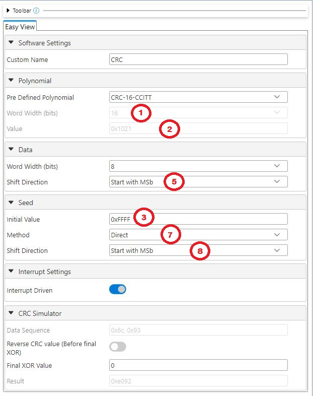

<picture>
  <source media="(prefers-color-scheme: dark)" srcset="./images/microchip_logo_white.png">
  <source media="(prefers-color-scheme: light)" srcset="./images/microchip_logo_black.png">
  
</picture>

# dsPIC33A CRC Basic Code Example

The code example uses MPLAB® Code Configurator Melody CRC Driver to configure CRC using the standard CRC-16-CCITT settings and calculate the hardware CRC result. The hardware CRC computation is then compared with a software implementation to verify results. The result is displayed on the terminal.

## Related Documentation

[MCC Melody CRC API Reference](https://onlinedocs.microchip.com/v2/keyword-lookup?keyword=CRC_16BIT_MELODY_DRIVER&version=latest&redirect=true)

## Software Used 

### Required Software

- MPLAB® X IDE **6.20** or newer (https://www.microchip.com/MPLABXIDE)
- MPLAB® XC-DSC Compiler **3.10** or a newer compiler (https://www.microchip.com/xcdsc)
- MPLAB® Code Configurator (MCC) Plugin **5.5.1** or newer (https://www.microchip.com/mcc)
- MPLAB® Code Configurator (MCC) Core **5.7.1** or newer (https://www.microchip.com/mcc)
- MPLAB® Code Configurator (MCC) Melody **2.7.1** or newer (https://www.microchip.com/melody)
- MCC PIC24/dsPIC Devices **5.12.2** or newer (MCC Content Manager) 
- CRC Driver **1.0.4** or newer (MCC Content Manager)
- CRC PLIB **1.0.1** or newer (MCC Content Manager)
- UART Driver **1.10.2** or newer (MCC Content Manager)
- UART PLIB **1.0.1** or newer (MCC Content Manager)
- Any terminal program, like MPLAB® Data Visualizer (https://www.microchip.com/datavisualizer) or Tera Term (https://ttssh2.osdn.jp/index.html.en)

## Hardware Used

### Required Hardware

- [dsPIC33A Curiosity Development Board](https://www.microchip.com/ev74h48a)
- [dsPIC33AK128MC106 DIM](https://www.microchip.com/EV02G02A)

## Hardware Setup

1. Connect the board to the PC using a USB cable.

    

## Software Setup

### Terminal Setup (Data Visualizer)

1. Launch the MPLAB® Data Visualizer.

    

2. Find the correct COM Port from the list on the left and click the play button.

    

3. Select the "Send to Terminal" button.

    

4. Click on the settings icon next to the source dropdown in the input section.

    

5. Verify that the serial port settings match the following:

    

### Terminal Setup (Tera Term)
1. Launch Tera Term
2. Go to File -> New Connection.
3. Select the "Serial" option and select the correct COM Port from the dropdown menu.

    

4. Go to Setup -> Serial port and ensure that the settings match the following:

    

### MPLAB® X IDE Setup
1. Launch MPLAB® X IDE and load the dspic33a-crc-basic project.
2. Build and program the device. 

## CRC Settings

The following settings are used in the calculation of CRC values:

1. CRC Order: Length (in bits) of the polynomial
2. Polynomial: Generator polynomial used in the calculation of the CRC value. Many effective polynomials exist, but some of the most common are CRC-16-CCITT (0x1021) and CRC-32 (0x04C11DB7).
3. Initial Value: The initial value of the CRC result. Can theoretically be anything, but traditionally is either zero (0x0000 for 16-bit or 0x00000000 for 32-bit) or -1 (0xFFFF for 16-bit or 0xFFFFFFFF for 32-bit).
4. Final XOR Value: The value XOR'd with the CRC result after the calculation and any reverses. Can theoretically be anything, but traditionally is either zero (0x0000 for 16-bit or 0x00000000 for 32-bit) or -1 (0xFFFF for 16-bit or 0xFFFFFFFF for 32-bit).
5. Shift Direction: The direction the data is shifted through the registers. Can start with the most significant bit (MSB) or the least significant bit (LSB)
6. Reverse: The result of the CRC calculation can be reversed immediately after calculation. The value is true (perform reverse) or false (no reverse).
7. Seed Input Method: Can be direct (which is just the initial value) or nondirect (the result of a CRC calculation where the initial value is the input). 
8. Seed Shift Direction: The direction the seed is shifted through the registers. Can start with the most significant bit (MSB) or the least significant bit (LSB).

For CRC-16-CCITT, the settings are as follows:

1. CRC Order: 16
2. Polynomial: 0x1021
3. Initial Value: -1 (0xFFFF)
4. Final XOR Value: 0 (0x0000)
5. Shift Direction: MSB
6. Reverse: No Reverse
7. Seed Input Method: Direct
8. Seed Shift Direction: MSB

### Online Calculator

Online calculators can be used to test different configurations and try different settings. Most developers compare results with an online calculator for comparison purposes. An example that was used in the development of this code example is the [Online Calculator by Sven Reifegerste (Zorc)](http://www.zorc.breitbandkatze.de/crc.html).

Online Calculator:

**Note**: Number 8, Seed Shift Direction, is assumed to be MSB in this online calculator.

MCC Melody: 

**Note**: The "Reverse CRC value" and "Final XOR Value" only work for the simulator, they will not be used in the firmware calculations.

The firmware function CRC_CalculationGet() is where the Reverse and Final XOR Value settings are implemented.

For this code example, the calculation performed by the MCC Melody CRC Driver can be replicated with the online calculator by the following steps:
- Select "CRC-CCITT" button.
- Enter the folowing for "data sequence": %6c%93
- Click the "compute" button.
  
The result should be 0xE092, matching the calculation performed by the MCC Melody CRC Driver.

## Operation

Once the project is built and the device is programmed, the terminal program will print the results of both the hardware and software calculations.

